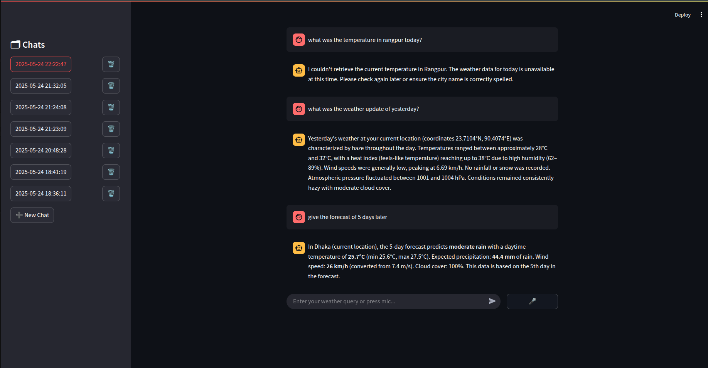

# 🌦️ Weather Agentic AI

An intelligent, conversational weather assistant built with **Langchain**, **Streamlit**, **Firebase**, and **ElevenLabs**. Ask weather-related questions via **text or voice**, get precise answers, and hear them spoken back to you.

<div align="center">
  
  
</div>

---

## 🧠 Features

- 💬 Conversational weather assistant
- 🎙️ Voice input using **ElevenLabs Speech-to-Text**
- 🔊 Voice responses with **ElevenLabs Text-to-Speech**
- 💾 Chat memory with Firebase (multiple chat sessions)
- 🧭 Real-time weather data fetching via LLM agent
- 🧹 Delete individual chat sessions
- 📋 Intuitive chat-style UI using **Streamlit**

---

## 📸 Demo

> 
---

## 🚀 Quick Start

### 1. Clone the Repo

```bash
git clone https://github.com/Saon110/Weather_Agentic_Ai.git
cd Weather_Agentic_Ai
```

### ✅ 2. Create a Virtual Environment

```bash
# For Linux/macOS
python3 -m venv env_name
source env_name/bin/activate

# For Windows
python -m venv env_name
env_name\Scripts\activate
```

### 3. Install Requirements

```bash
pip install -r requirements.txt
```

**`requirements.txt` includes:**

- `streamlit`
- `speechrecognition`
- `pyaudio`
- `elevenlabs`
- `firebase-admin`
- `requests`
- `python-dotenv`

### 3. Setup API Keys

Create a `.env` file with the following:

```env
GROQ_API_KEY=groq_api_key
OPENWEATHERMAP_API_KEY=openweathermap_api_key
ELEVENLABS_API_KEY=elevenlabs_api_key
ELEVENLABS_VOICE_ID=21m00Tcm4TlvDq8ikWAM
ELEVENLABS_MODEL_ID=eleven_monolingual_v1
FIREBASE_TYPE=service_account
FIREBASE_PROJECT_ID=weather-ai-agent-1c82f
FIREBASE_PRIVATE_KEY_ID=firebase_private_key_id
FIREBASE_PRIVATE_KEY=firebase_private_key
FIREBASE_CLIENT_EMAIL=client_email
FIREBASE_CLIENT_ID=client_id
FIREBASE_CLIENT_X509_CERT_URL=client_certificate_url #this informations can be downloaded upon creating a firebase database
```

### 4. Run the App

```bash
streamlit run app.py
```

---

## 🗂 Project Structure

```
.
├── app.py                  # Main Streamlit app
├── firebase_chat.py        # Firebase chat handling
├── firebase_setup.py       # Firebase setup
├── weather_agent.py        # Weather reasoning agent
├── voice_utils.py             # Combined voice input/output with ElevenLabs
├── requirements.txt
└── .env
```

---

## 🛠️ TODO

- [ ] Add unit tests
- [ ] Add a frontend for selecting city/location
- [ ] Deploy on Streamlit Cloud or Hugging Face Spaces
- [ ] Support more languages in STT/TTS

---

## 🧑‍💻 Author

Made by [**Sijon Chisty Saon**](https://github.com/Saon110)

---

## 📄 License

This project is licensed under the MIT License - see the [LICENSE](LICENSE) file for details.
